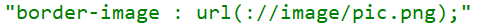
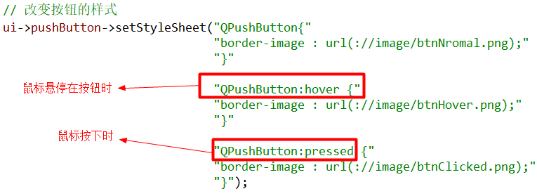
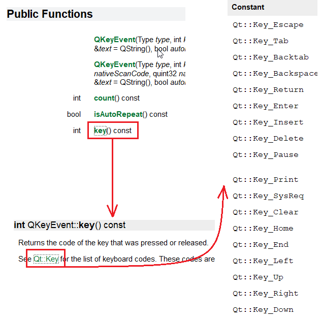
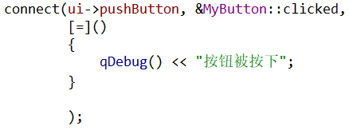

# Day 02 (2020-07-21)

# 1. 设计器使用

## 1.1 QPushbutton

示例解析：  


打开界面文件（以ui为后缀的文件）：  


- 如何使用代码对ui进行编程


> 如果使用ui设计器来进行界面绘制，则界面中的所有控件都是通过ui对象指针来进行控制
>
> 如果需要访问界面中的按钮，可以：
>
> ```c++
> ui->myButton->setText("内容已修改");
> ```

## 1.2 一种通过ui添加槽函数的方法


直接在ui界面对按钮右击，然后点击转到槽  


选择对应的槽函数后，直接回跳转到函数体，其函数命名为on_change_clicked，这种方式的槽函数不需要编写connect函数。  


## 1.3 获取行编辑内容  


- 对内容显方式进行修改


- 以密码的方式进行显示


> 查看setEchoMode函数的帮助文档可以看到参数的选择
>
> 


- 显示提示

首先添加头文件QCompleter  


具体的，先创建list存放提示，创建提示对象指针，通过构造函数使用list初始化，最后将lineEdit设置提示。  


效果如图所示：  


## 1.4 通过QLabel显示文字、图片、gif、网址  

- 显示文本


- 添加资源


选择“添加新文件”  


选择Qt->Qt Resource File  


右击image.qrc文件然后选择Open in Editor  


首先需要添加前缀，然后将默认前缀修改为斜杠，之后才能点击添加文件  


添加好资源后，右击资源然后选择肤质资源路径到剪贴板  


如果不知道setPixmap函数的使用方式，F1看帮助文档  


函数需要一个QPixmap类型的引用，点击QPixmap然后选择公有函数，看到有很多的构造函数，然后点击下图的构造函数，其参数只需要一个路径  


- QLabel添加gif


- QLabel添加网页URL链接


## 1.5 设置数码管  


## 1.6 设置进度条  


# 2. 布局

## 2.1 常用布局

1. Qt提供两种定位机制  

- 绝对定位（上一节使用）
- 布局定位（布局管理器）

2. 为什么需要布局

> 在窗口设计好之后，缩小界面大小，部分控件就会无法显示，因此使用布局来让控件跟随窗口大小一起缩放

3. 局部布局与整体布局

- 局部布局（不会令界面中的控件跟随界面缩放）


- 整体布局（选择界面空白处点击，选择窗口，然后点击布局按钮）


> 窗口缩小后按钮也会随之缩小
>
> 

（4）三种布局方式

- 水平布局
- 垂直布局
- 网格布局


（5）弹簧的使用

- 为了占位


（6）水平、竖直分裂布局


（7）设置布局间隔


## 2.2 登录窗口布局

1. UI设计器中进行编辑


2. 添加资源文件
3. 在构造函数中显示imgLabel图片


## 2.3 自定义控件

1. 新建类SmallWidget来实现自定义控件


2. 构造QSpinBox和QSlider对象指针

- 根据QSlider构造函数的帮助文档


- 进一步点击第一个枚举类型


3. 然后在UI界面提升Widget控件

- 右击控件点击提升为


- 键入刚才创建好的类名，点击添加


- 此时会有创建好的类，然后点击提升


- 现在的这个对象所属的类已经改变


- 最后的运行结果


3. 将两个控件的数值进行关联

- 首先是QSpinBox->QSlider


>对于该connect函数，对于spin来说，需要F1查看其能够发送的信号
>
>
>
>由于spin的信号存在重载，如果简单的写`&QSpinBox::valueChanged`则系统不知道调用的是哪一个函数，因此需要进行强制类型转换。
>
>使用`static_cast<函数指针>()`来进行强制类型转换
>
>对于函数指针格式为：`void (*函数名)(参数)`
>
>对于类的成员函数，函数指针需要指明类：`void (&QSpinBox::*)(int)`

- 第二步骤是QSlider->QSpinBox


## 2.4 样式表

1. 什么是样式表

> Qt样式表的思想很大程度是来自HTML的层叠式样式表（CSS），通过调用`QWidget::setStyleSheet()`或`QApplication::setStyleSheet()`，可以为一个独立的子部件、整个窗口、甚至是整个应用程序指定样式表

2. Qt样式表查询的方法


3. 样式表语法

Qt样式表与CSS的语法规则几乎完全相同，一个样式表由一些列的样式规则组成，每个样式规则都有着下面的形式：  

> `selector {attribute : value}`

- 选择器（selector）
  - 部分通常是一个类名，当然也还有其他的语法形式
- 属性（attribute）、值（value）
  - 属性部分是一个样式表属性的名字，值部分是付给属性的值

```c++
// 给一个标签设计一个样式表
QLabel {color : red; }
QCheckBox, QComboBox, QSpinBox {
    color : red;
    background-color : white;
    font : bold;
}
```

例子：  


4. 方箱模型

在样式表中，每个部件都被看作是一个由四个同心相似的巨型组成的箱体：  

- 空白（margin）
  - 空白区域位于边框外，并且是透明的
- 边框（border）
  - 边框为部件提供四周的框架，其`border-style`border-style`属性可以设置为一些内置的框架风格
  - inset、outside、solid、ridge
- 填充（padding）
  - 填充在边框和内容区域之间提供了空白间隔
- 内容（content）
  - 对于一个平面部件，例如一个空白，边框和填充都是0像素的部件而言，这四个举行时完全重合的


5. 前景和背景

- color
- background-color

- background-image


> 默认图片是平铺的， 可以通过属性设置平铺方式：
>
> - background-positon 位置
> - background-repeat 是否重复

6. 创建可缩放样式

默认情况下，通过background-image指定的背景图片会自动重复平铺，已覆盖部件的整个填充矩形，如果想创建能够随部件大小自动缩放而不是平铺的背景，要设置一个称为“<u>***边框图片***</u>”的东西。  

- 边框图片可以通过“<u>***border-image***</u>”设置，同时提供部件的背景和边框
- 边框图片被分为九部分
- 当一个部件的边框被填充时，四角的格子通常不会发生变化，而其余五个格子则可能被拉伸或平铺以填充可用空间

> ```c++
> QPushButton {
> 	border-width : 4px;
> 	border-image : url(button.png) 4 4 4 4 stretch stretch;
> }
> ```



7. 控制大小

- min-width
- min-height

以上两个属性可以用来指定一个部件的内容区域的最小大小，两个值将影响部件的mininumSizeHint()，病在布局时被考虑。  

> ```c++
> QPushButton {
> 	min-width : 68px;
> 	min-height : 28px;
> }
> ```

8. 处理伪状态

部件的外观可以按照用户界面元素状态的不同来分别定义，这在样式表中被称为“伪状态”。例如，如果我们想在一个QPushButton按下时具有sunken的外观，可以指定一个叫做"<u>***:pressed***</u>"的伪状态。  

> ```c++
> QPushButton {
> 	border : 2px outset green;
> 	background : gray;
> }
> 
> QPushButton : pressed {
>     border-style : inset;
> }
> ```

下面是可用的伪状态列表 :ballot_box_with_check:

| 伪状态         | 描述                                       |
| -------------- | ------------------------------------------ |
| :checked       | button部件被选中                           |
| :disabled      | 部件被禁止                                 |
| :enabled       | 部件被启用                                 |
| :focus         | 部件获得焦点                               |
| :hover         | 鼠标位于部件上(放在上面):heavy_check_mark: |
| :indeterminate | checkBox或radioButton被部分选中            |
| :off           | 部件可以切换，且处于off状态                |
| :on            | 部件可以切换，且处于on状态                 |
| :pressed       | 部件被鼠标按下:heavy_check_mark:           |
| :unchecked     | button部件未被选中                         |



9. 使用子部件定义微观样式

许多部件都包含子元素，这些元素可以称为“子部件”，SpinBox的上下箭头就是子部件最好的例子。  

子部件可以通过“<u>***::***</u>”来指定，例如`QDateTimeEdit::up-button`。定义子部件的样式与定义部件非常类似，它们遵循前面提到的方箱模型，并且可以和伪状态联合使用，例如`QSpinBox::up-button:hover`。  

下面是可用的子部件类型:ballot_box_with_check::

| 子部件           | 描述                                        |
| ---------------- | ------------------------------------------- |
| ::down-arrow     | comboBox或spinBox的下拉箭头                 |
| ::down-button    | spinBox的向下按钮                           |
| ::drop-down      | comboBox的下来箭头                          |
| ::indicator      | checkBox、radioButton或可选groupBox的指示器 |
| ::item           | menu、menuBar、statusBar的子项目            |
| ::menu-indicator | pushButton的菜单指示器                      |
| ::title          | groupBox的标题                              |
| ::up-arrow       | spinBox向上箭头                             |
| ::up-button      | spinBox向上按钮                             |

## 2.5 事件

1. 相关概念

事件（Event）是由系统或Qt本身在不同时刻发出的，当用户按下鼠标、敲下键盘，或者是窗口需要重新绘制时，都会发出一个相应的事件。一些事件在对用户操作做出响应时发出，如键盘事件；另一些事件则是由系统自动发出，如计时器事件。  

在前面提到，Qt程序需要在`main()`函数创建一个`QApplication`对象，然后调用它的`exec()`函数。这个函数就是开始Qt的事件循环。在执行`exec()`之后，程序将进入事件循环来监听应用程序的事件。当事件发生时，Qt创建一个事件对象。Qt中所有的事件类都继承`QEvent`。在事件对象创建完毕后，Qt将这个事件对象传递给`QObject`的`event()`函数，该函数并不直接处理事件，而是按照时间对象的类型分派给特定的事件处理函数（`event handler`）。  


在所有组件的父类`QWidget`中，定义了很多事件处理的回调函数，如

- keyPressEvent()
- keyReleaseEvent()
- mouseDoubleClickEvent()
- mouseMoveEvent()
- mousePressEvent()
- mouseReleaseEvent()
- 等等

这些函数都是`protected virtual`的，我们可以在子类中重新实现这些函数。


2. 鼠标事件（在新建类中创建）

- 鼠标点击事件响应

首先新建一个项目，然后在ui中拖拽一个QLabel控件，设置这个窗口为垂直布局。  

然后新建一个c++类`MyLabel`让其继承`QLabel`，但是Qt的基类选择只有`QWidget`，先选择它，然后在文件中进行基类修改。  


然后需要在MyLabel类中继承基类的虚函数：  


查看`QMouseEvent`帮助文档，然后点击公有函数中的`Button()`函数：  

\

该函数返回值为枚举类型`Qt::MouseButton`，具体的为：  


还需要的公有函数为`globalPos()`：


> 需要区分的是：
>
> - globalPos 为全局坐标，相对于屏幕而言
> - localPos为局部坐标，相对于控件而言
> - windowsPos为窗口坐标，相对于窗口而言

接下来编辑`MyLabel::mousePressEvent`函数：  


但是，此时编译运行并不能获取鼠标点击的坐标，原因是ui中的label为`QLabel`，因此还需要将其提升为`MyLabel`：  


现在，点击窗口后会显示鼠标坐标的位置信息：  


此时点击窗口外是没有响应的，因为所使用的是`windowsPos()`函数，只对窗口位置的鼠标点击事件进行响应。  

- 鼠标移动响应

鼠标移动和鼠标按下的操作基本一致，同样是通过获取ev的参数进行显示，但是当程序第一次执行时，`MyLabel`显示的是默认值，只有当鼠标按下后才开始对鼠标进行追踪。如果想一进来就对鼠标进行追踪，需要在`MyLabel`构造函数中进行设置：


3. 键盘事件（在Widget类中实现）

首先，在Widget中重写键盘按下的事件相应函数：  


其中`QKeyEvent`对象有一个函数`key()`，该函数能够返回键盘对应的`int`型枚举：  



在事件处理中对所按下的字符进行输出显示：  


4. 计时器事件

重写计时器事件的函数：  


计时器是需要启动的，在构造函数中进行计时器的启动，以毫米为单位：  


在计时器事件的响应函数中，通过timerId来对定时器进行区分：  


计时器最后可以进行删除，同样通过timerId来进行关闭，本例子中通过按下键盘F1键来关闭计时器：  


## 2.6 事件的接受与忽略

1. 手写事件的接受与忽略

前面介绍了事件的相关内容，事件可以依情况接受和忽略，现在就来了解事件的更多知识。  

首先创建一个`MyButton:QPushButton`，然后在ui中创建一个`QPushButton`提升为`Mybutton`。  

在`Widget`类的构造函数中编写`connect`函数，只有鼠标点击就会打印一句话。  



然后在`MyButton`类中重写鼠标按下的事件，对鼠标左键点击事件进行响应，对其他的鼠标事件进行忽略。  


此时，点击按钮，如果是左键点击就会输出“左键按下”，其他键点击按钮就不会有任何输出。  


因为信号被事件拦截了，并进行了处理，如果是左键输出，不是就交给父对象，这个信号被忽略了，就不会再有`clicked`信号传送到槽函数，因此槽函数就不会有输出。

2. Qt内置函数

- accept()
  - 用来告诉Qt，这个类的事件处理函数想要处理这个事件，如果一个事件处理函数调用了一个事件对象accept()函数，这个事件就不会被继续传播给其他父组件
- ignore()
  - 用来告诉Qt，这个类的事件处理函数不想要处理这个事件，如果调用了事件的ignore()函数，Qt会从其他父组件中寻找另外的接受者
- isAccepted()
  - 在事件处理函数中，可以使用isAccept()函数来查询这个事件是不是已经被接受

> 一个MyButton的鼠标点击事件，进行ignore()，则信号会继续传递，但是传递给谁？
>
> 答案：不是父类（基类），而是<u>***父组件***</u>。
>
> 
>
> MyButton的父组件为Widget，为了验证，修改Widget类的鼠标点击事件：
>
> 
>
> 然后左键点击按钮会显示“左键按下”，其他键点击按钮，会显示“这是Widget类的mousePressEvent”

3. accept和ignore的典型应用

在关闭窗口时，弹出提示框，提问用户是否确定关闭，如果确定，就需要`accept()`接受事件，事件就不会往下传；如果用户点击取消，就需要`ignore()`忽略事件，然后事件会继续给父组件传递，界面返回。


## 2.7 event()函数

1. event函数的作用


2. 重写事件分发函数


查看`QEvent`的帮助文档，然后点击`public function`，选择`type()`函数，查看其返回值：  


在`event()`函数中，返回值为`bool`类型：  

- 如果传入的事件已被识别并且处理，则需要返回`true`，否则返回`false`。如果返回值是`true`，那么Qt会认为这个事件已经处理完毕，不会再将改时间发送给其他对象。

在`event()`函数中处理定时器的事件，对于其他事件直接给父类的默认事件分发函数：  


## 2.8 事件过滤器

1. 使用`event()`函数可以进行事件过滤，为何还需要事件过滤器？


对于某一个控件或者一个窗口而言，使用`event()`固然方便，但是对于一个应用程序，有若干个控件，这种方式难以管理事件，使得效率低下。事件是经过事件过滤器然后经过`event()`的，因此在事件过滤器中对事件进行过滤会更加方便。  

2. 事件过滤器函数原型

`QObject`有一个函数`eventFilter()`函数，用于建立事件过滤器，其函数原型如下：  


- `QObject *watched`参数指定关心的控件
- `QEvent *event`参数指定关心的事件

- 该函数返回`bool`类型，如果你想将参数event过滤出来，就返回true，否则返回false

3. 具体例子

首先在Widget中创建事件过滤器：  


该函数只是对过滤器进行了创建，还需要对具体某一个控件进行“过滤器安装”，需要在构造函数中进行过滤器安装，函数`installEventFilter()`需要一个参数来指定事件接受处理的对象：  


具体事件过滤器的写法为：  


4. 关于事件过滤器需要说明部分

事件过滤器和被安装过滤器的组件必须在同一线程，否则过滤器将不起作用。另外，如果在安装过滤器之后，这两个组件到了不同的线程，那么只有等到二者重新回到同一线程的时候过滤器才会有效。


