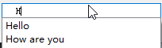
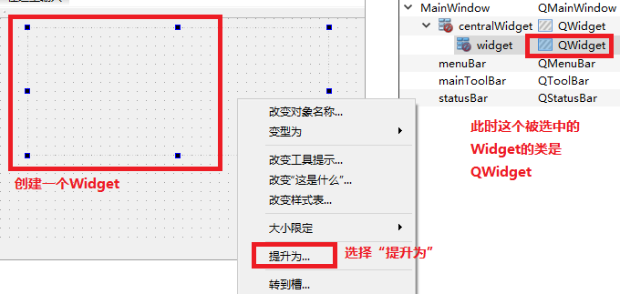

# Day 02 (2020-07-21)

# 1. 设计器使用

## 1.1 QPushbutton

示例解析：  


打开界面文件（以ui为后缀的文件）：  


- 如何使用代码对ui进行编程


> 如果使用ui设计器来进行界面绘制，则界面中的所有控件都是通过ui对象指针来进行控制
>
> 如果需要访问界面中的按钮，可以：
>
> ```c++
> ui->myButton->setText("内容已修改");
> ```

## 1.2 一种通过ui添加槽函数的方法


直接在ui界面对按钮右击，然后点击转到槽  


选择对应的槽函数后，直接回跳转到函数体，其函数命名为on_change_clicked，这种方式的槽函数不需要编写connect函数。  


## 1.3 获取行编辑内容  


- 对内容显方式进行修改


- 以密码的方式进行显示


> 查看setEchoMode函数的帮助文档可以看到参数的选择
>
> 


- 显示提示

首先添加头文件QCompleter  


具体的，先创建list存放提示，创建提示对象指针，通过构造函数使用list初始化，最后将lineEdit设置提示。  


效果如图所示：  



## 1.4 通过QLabel显示文字、图片、gif、网址  

- 显示文本


- 添加资源


选择“添加新文件”  


选择Qt->Qt Resource File  


右击image.qrc文件然后选择Open in Editor  


首先需要添加前缀，然后将默认前缀修改为斜杠，之后才能点击添加文件  


添加好资源后，右击资源然后选择肤质资源路径到剪贴板  


如果不知道setPixmap函数的使用方式，F1看帮助文档  


函数需要一个QPixmap类型的引用，点击QPixmap然后选择公有函数，看到有很多的构造函数，然后点击下图的构造函数，其参数只需要一个路径  


- QLabel添加gif


- QLabel添加网页URL链接


## 1.5 设置数码管  


## 1.6 设置进度条  


# 2. 布局

## 2.1 常用布局

1. Qt提供两种定位机制  

- 绝对定位（上一节使用）
- 布局定位（布局管理器）

2. 为什么需要布局

> 在窗口设计好之后，缩小界面大小，部分控件就会无法显示，因此使用布局来让控件跟随窗口大小一起缩放

3. 局部布局与整体布局

- 局部布局（不会令界面中的控件跟随界面缩放）


- 整体布局（选择界面空白处点击，选择窗口，然后点击布局按钮）


> 窗口缩小后按钮也会随之缩小
>
> 

（4）三种布局方式

- 水平布局
- 垂直布局
- 网格布局


（5）弹簧的使用

- 为了占位


（6）水平、竖直分裂布局


（7）设置布局间隔


## 2.2 登录窗口布局

1. UI设计器中进行编辑


2. 添加资源文件
3. 在构造函数中显示imgLabel图片


## 2.3 自定义控件

1. 新建类SmallWidget来实现自定义控件


2. 构造QSpinBox和QSlider对象指针

- 根据QSlider构造函数的帮助文档


- 进一步点击第一个枚举类型


3. 然后在UI界面提升Widget控件

- 右击控件点击提升为



- 键入刚才创建好的类名，点击添加


- 此时会有创建好的类，然后点击提升


- 现在的这个对象所属的类已经改变


- 最后的运行结果


3. 将两个控件的数值进行关联

- 首先是QSpinBox->QSlider


>对于该connect函数，对于spin来说，需要F1查看其能够发送的信号
>
>
>
>由于spin的信号存在重载，如果简单的写`&QSpinBox::valueChanged`则系统不知道调用的是哪一个函数，因此需要进行强制类型转换。
>
>使用`static_cast<函数指针>()`来进行强制类型转换
>
>对于函数指针格式为：`void (*函数名)(参数)`
>
>对于类的成员函数，函数指针需要指明类：`void (&QSpinBox::*)(int)`

- 第二步骤是QSlider->QSpinBox


## 2.4 样式表

1. 什么是样式表

> Qt样式表的思想很大程度是来自HTML的层叠式样式表（CSS），通过调用`QWidget::setStyleSheet()`或`QApplication::setStyleSheet()`，可以为一个独立的子部件、整个窗口、甚至是整个应用程序指定样式表

2. Qt样式表查询的方法


3. 样式表语法

Qt样式表与CSS的语法规则几乎完全相同，一个样式表由一些列的样式规则组成，每个样式规则都有着下面的形式：  

> `selector {attribute : value}`

- 选择器（selector）
  - 部分通常是一个类名，当然也还有其他的语法形式
- 属性（attribute）、值（value）
  - 属性部分是一个样式表属性的名字，值部分是付给属性的值

```c++
// 给一个标签设计一个样式表
QLabel {color : red; }
QCheckBox, QComboBox, QSpinBox {
    color : red;
    background-color : white;
    font : bold;
}
```

例子：  


4. 方箱模型

在样式表中，每个部件都被看作是一个由四个同心相似的巨型组成的箱体：  

- 空白（margin）
  - 空白区域位于边框外，并且是透明的
- 边框（border）
  - 边框为部件提供四周的框架，其`border-style`border-style`属性可以设置为一些内置的框架风格
  - inset、outside、solid、ridge
- 填充（padding）
  - 填充在边框和内容区域之间提供了空白间隔
- 内容（content）
  - 对于一个平面部件，例如一个空白，边框和填充都是0像素的部件而言，这四个举行时完全重合的


5. 前景和背景

- color
- background-color

- background-image


> 默认图片是平铺的，


