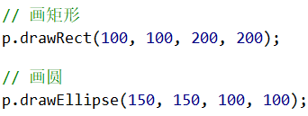
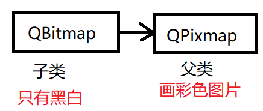

# day03（2020-07-23）

# 1. 绘图

## 1.1 画背景图

1. 所使用到的类


2. 重写虚函数事件


3. 虚函数实现


- 声明`QPainter`

构造函数需要传递一个`QPaintDevice`，这里使用`this`表示在该窗口进行绘制，之所以可以这样使用是因为`MyWidget`的父类`QWidget`是多重继承，也继承自`QPaintDevice`。可以通过帮助文档来进行查看：  


同样查看`QWidget`类的声明帮助可以看到其继承自`QPaintDevice`：  


- 绘制过程

```c++
p.begin();
// 绘制过程
p.end();
```

- 绘制背景

改变窗口的大小，背景图会跟着进行改变，是因为函数`drawPixmap`中会通过`width()`和`height()`函数对改变后的窗口大小进行获取，并重新调用绘制事件。


## 1.2 简单绘图

1. 画直线

- 创建画笔


其中画笔的风格可以进行修改，具体查看枚举类型：  


- 设置画笔


- 绘画


- 结果


2. 画矩形、圆

- 创建画刷


- 设置画刷


- 画图形



- 结果


## 1.3 手动更新窗口

1. 手动重绘相关的帮助文档查询


2. 点击按钮移动笑脸

首先在ui界面添加按钮，并使用“转到槽”快速构件槽函数。  

设置成员变量`x`来表示笑脸的x轴坐标，然后在槽函数中实现x的改变，最后更新窗口。  


- 注意`update()`函数会自动调用`paintEvent`函数
- 不能在`paintEvent`函数中进行`update()`，会死循环
- 绘图事件随时调用，自动触发，不要在此处处理复杂的数据

## 1.4 QBitmap和QPixmap区别

1. 主要区别



2. 实验对比


- 因为QBitmap是继承自QPixmap的，所以使用的是一样的函数绘制接口，唯一不同的是参数使用的是`QBitmap`

- 结果


## 1.5 QPixmap绘图设备

1. 三种常用绘图设备

- `QPixmap`
  - 针对屏幕进行优化，和平台相关，不能够对图片进行修改
- `QImage`
  - 和平台无关，有自己绘图系统，可以对图片进行像素点修改，<u>***可以在线程里面绘图***</u>，例如在导航软件中，用户不停在改变方位，需要开一个线程不停的画；或者视频开一个线程，不停画。
- `QPicture`
  - 保存绘图的状态，存在二进制文件。保存完后在另一个平台进行读取。

2. 在QPixmap上绘制图形

- 之前是重载了绘图函数，然后需要在绘图函数中创建绘图设备
- 这里的绘图设备不是窗口，而是Pixmap，因此不需要重载函数，直接写在构造函数中


Pixmap需要对绘制的图片进行保存，运行后会加载一个空窗口，然后在指定的路径找到文件：  


3. 在QImage上绘制图形

- 首先查看其构造函数，需要多一个Format参数，该参数为枚举


- 构造绘图设备后，设置绘图工具，绘制图形，最后由绘图设备保存图片


- 关于路径的问题

在qtcreator运行时，会将debug路径忽略，因此`build-04_QImage-Desktop_Qt_5_9_0_MinGW_32bit-Debug`为当前路径。  

- 对像素点进行操作


4. 使用`QPicture`保存和加载绘图的二进制文件


- 保存后，理论上应该在评一个平台的机子上加载这个二进制文件，此处本地加载模拟一下这个过程，将加载后的图面绘制在窗口上


- 图片最终加载绘制成功


- 需要说明的是，如果运行后发现图片没有加载出来，并且有一个警告说你的绘制工具没有停止仍然在绘制，检查一下程序是否有`p.end()`

## 1.6 QImage和QPixmap的相互转化

1. 为什么需要转化？

因为`QImage`与平台无关，有时候在网络传输的时候传的是`QImage`类型的，而在绘制的时候可能会用到`QPixmap`类型，因为`QPixmap`会针对屏幕进行优化。  

2. 如何转化？


3. 结果


## 1.7 不规则窗口

1. 在窗口中添加一个不规则图片


重写重绘函数，然后在窗口中绘制一张图片。  

2. 设置窗口样式

- 去除边框


对于窗口样式的枚举，可查看帮助文档：  


鼠标点击并拖动窗口的位置是下图红色点，但是窗口移动的是绿色点，所以需要通过红色点的坐标获取绿色点的坐标，然后才能进行窗口移动。  


# 2. 文件

## 2.1 QFile读写文件

1. `QIODevice`类结构


> `QBuffer`：内存文件
>
> `QProcess`：进程相关，启动外部程序
>
> `QFileDevice`：文件描述符操作
>
> `QAbstractSocket`：网络编程

2. 文件相关对话框

打开文件对话框：  

```c++
QString path = QFileDialog::getOpenFileName(this,
                "Open", "../", "TXT(*.txt)");
```

保存文件对话框：  

```c++
QString path = QFileDialog::getSaveFileName(this, "Save", "../", "TXT(*.txt)");
```

3. 读文件

- 创建文件对象

```c++
QFile file(path);
```

- 打开文件

```c++
bool isOK = file.open(QIODevice::ReadOnly);
```

- 读文件

```c++
// 方式一：全部读取
QByteArray array = file.readAll();

// 方式二：按行读取
QByteArray array;
while (file.atEnd() == false)
{
    // 读一行
    array += file.readLine();
}
```

- 关闭文件

```c++
file.close();
```

4. 获取文件相关信息

文件信息的获取，与文件的打开和关闭无关，只需要提供文件路径。  

```c++
QFileInfo info(path);
qDebug() << QStringLiteral("文件名:") << info.fileName();
qDebug() << QStringLiteral("文件后缀:") << info.suffix();
qDebug() << QStringLiteral("文件大小:") << info.size();
qDebug() << QStringLiteral("文件创建时间:") << info.created().toString("yyyy-MM-dd hh:mm:ss");
```

5. 写文件

- 创建文件对象

```c++
QFile file(path);
```

- 打开文件

```c++
bool isOK = file.open(QIODevice::WriteOnly);
```

- 写文件

```c++
file.write(str.toUtf8());
```

6. 文件编码

- `QString`转`QByteArray`

> 中文：`str.toUtf8()`
>
> 本地编码：`str.toLocal8Bit()`

- `QByteArray`转`char*`

> `array.data()`

- `char*`转`QString`

> `QString(buf)`

## 2.2 QDataStream读写文件

数据流读写文件时，文件的形式不仅仅为文本，可以是任意的视频、语音文件。  

1. 数据流写文件

- 创建文件对象

```c++
QFile file("../text.txt");
```

- 打开文件

```c++
bool isOK = file.open(QIODevice::WriteOnly);
```

- 创建数据流，和文件相关联

```c++
QDataStream stream(&file);
```

- 往数据流中写数据，会直接写入文件

```c++
stream << QString("NickWang") << 250;
```

- 最后关闭文件

```c++
file.close();
```

写完的文件打开后会乱码，因为其是以流的形式进行存储，只要能够对应的读出来就行。  

2. 数据流读文件

- 以写数据流时相同的格式进行读取

```c++
stream >> str >> num;
```

3. 题外话

关于`qDebug()`的调试技巧：  

```c++
#define cout qDebug() << "[" << __FILE__ << ":" << __LINE__ << "]"
```

## 2.3 QTextStream

以文本流的方式操作文件，其优点是可以指定编码形式。

1. 写文件

- 创建文件对象

```c++
QFile file;
file.setFileName("text.txt");
```

- 打开文件

```c++
bool isOK = file.open(QIODevice::WriteOnly);
```

- 创建流对象，关联文件

```c++
QTextStream stream(&file);
```

- 设置编码格式

```c++
stream.setCodec("UTF-8");
```

- 写文件

```c++
stream << QStringLiteral("你好，这是测试文本") << 250;
file.close();
```

2. 读文件

注意：在使用`QTextStream`读文件时，不可以直接按照流的方式读取，因为流方式不能区分数据类型，会将数据看成`QString`连在一起。如用流写入一个文本和一个整形，读出的效果为：  


其中`250`为整形数据，被当作`QString`来处理了。  

因此正确的读取方式应该为：  

```c++
QString str = stream.readAll();
```

## 2.4  QBuffer

`QBuffer`为内存文件，写在内存缓冲区中。  

1. 构造`QBuffer`对象并打开

```c++
QBuffer memFile;
mamFile.open(QIODevice::WriteOnly);

```

2. 写入buffer中，然后进行关闭

```c++
memFile.write("1111");
memFile.close();
```

3. `QBuffer`的访问

```c++
qDebug() << memFile.buffer();
```

4. `QBuffer`与流的使用

```c++
QByteArray array;
QBuffer memFile(&array); // 创建内存文件
```

后续的写入操作，会将内容写入`array`中。